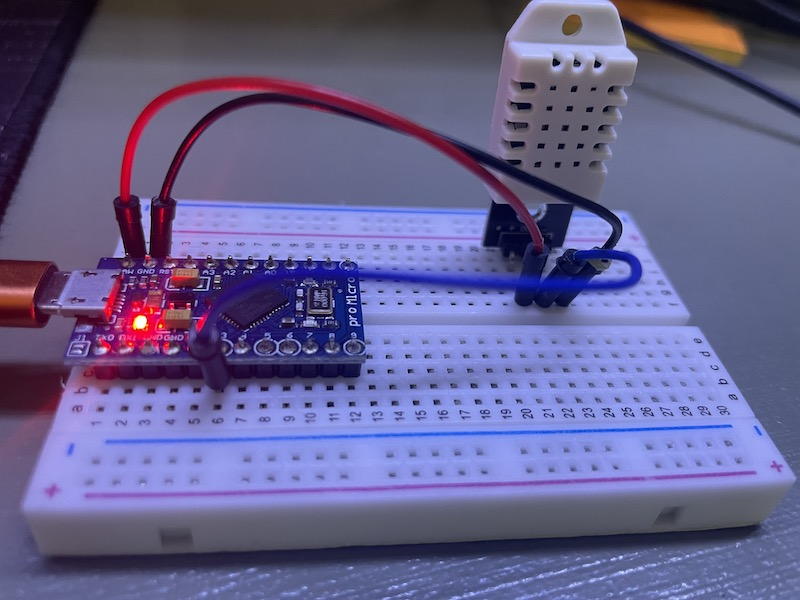

In this assignment, you will reuse the LCD screen. Instead of displaying a 'Happy Birthday' text, you will display the current temperature and humidity and update it every second.

# Hardware

DHT 22 temperature and humidity sensor.

Wiring:
* `+` to +5V (raw)
* `-` to  GND
* `OUT` to any GPIO pin. E.g. 3, as shown in the picture above. But any GPIO pin should work.

# Library

Install 'DHT sensor library', load up example `DHT tester`, change the pin assignment if needed, change the sensor type if needed (the one you were given is a DHT22). Open up the serial monitor (this is a good time to get used to the serial monitor and `Serial.print`!).

# Integration

Now, you have already been able to print the temperature and humidty data on the serial monitor, it's time to print it on the LCD screen!

To verify that it's actually working, try to manually change the temperature and humidity of the sensor by blowing it with a hair dryer (be careful not to overheat it), or put an ice pack on it (don't flood it though) and see if the readings change accordingly.

Extra credit:

* Display the temperature in both `F` and `C`
* Change the color based on the temperature. Redder is hotter and bluer is cooler.